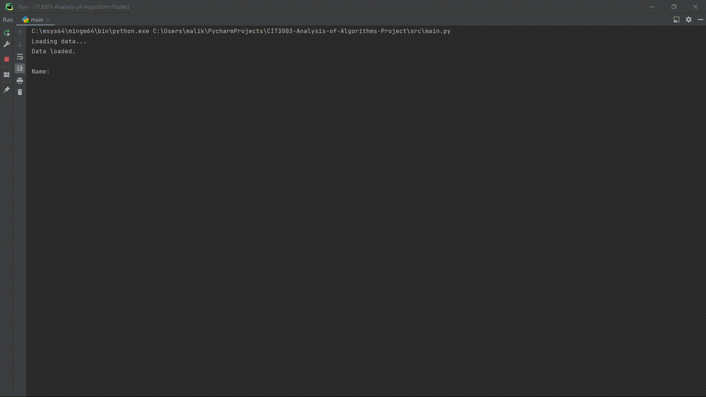

# Six Degrees of Separation

In this project, we are required to implement an algorithm that finds the degrees of separation between two persons and recommend to each person’s close contact, all the activities that the person is engaged in.

Please refer to the Project Outline for more information.

This project is based on implementations from https://github.com/priyanktejani/degrees and https://github.com/alireza-mahmoodi/Six_Degrees_of_Kevin_Bacon.git

# The Code in Action

In this section, we can see the end result of implementation by looking at how many degrees of separation two actors are from each other.

## Yvonne Dennis & Jason Hall

## Lawrence Smith & Oshaine Williams

## Lorna Jennings & Kenroy Johnson

